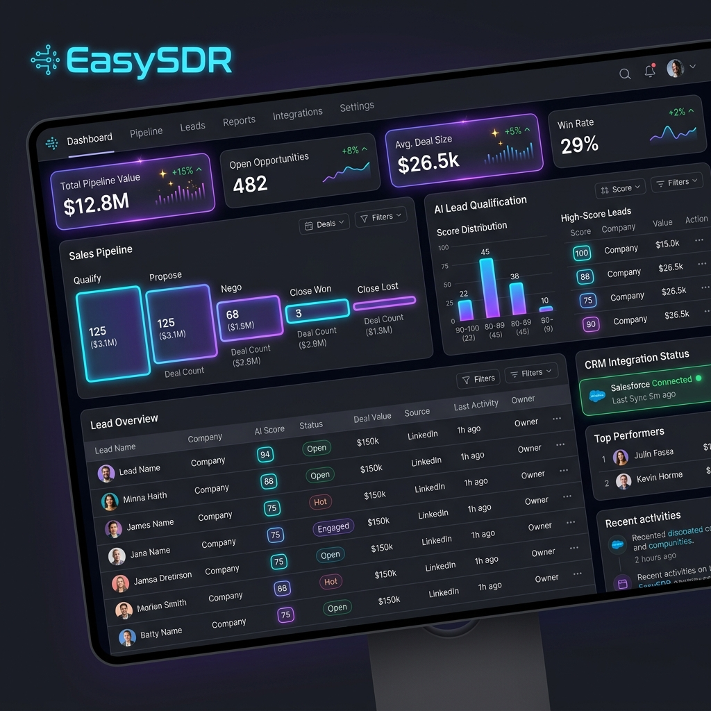

# EasySDR — Autonomous B2B Prospecting & CRM Sync Engine

EasySDR is an intelligent, self-learning prospecting dashboard and automated pipeline. It is designed to discover target companies, qualify fit using AI rules, scrape contact details, calculate verify-and-trust scores, and synchronize leads directly to CRM databases (like HubSpot).



---

## 🚀 Prototype Development Model

EasySDR is being built following the **Prototype Model of Software Development**. 

This release represents the **First Working Prototype** of the platform. The main goal of this version is to demonstrate the feasibility of the autonomous sales loop and gather real-world usage feedback. 

> [!IMPORTANT]
> **We Need Your Review!** As a working prototype, this software is open for feedback, trial runs, and structured user reviews. Your inputs on accuracy, UI design, and CRM synchronization behaviors are crucial to guide refactoring and shape the final release version.

---

## 💎 Features & Capabilities

### 1. Dynamic ICP Configuration
EasySDR adapts instantly to your targeting preferences. Users can customize the active Ideal Customer Profile (ICP) through the dashboard form, defining parameters such as:
* **Target Industries & Sub-verticals**
* **Geographical Scopes**
* **Workforce Size Ranges (Min/Max Employees)**
* **Required keywords** and **Excluded keywords** (to instantly penalize or disqualify non-aligned matches).

### 2. Multi-Channel Lead Discovery
* **Apollo organization Search**: Discovers matching target companies in real-time.
* **Direct Targeting & Batch Import**: Manually target single accounts or upload list files in bulk.
* **Global Index Search**: Performs live external search queries directly through the dashboard.

### 3. Dual-Layer Decision Maker Extraction
When target companies are qualified, EasySDR searches for high-priority decision-makers (CXOs, VPs, Heads of Claims/Operations):
* **Primary**: Pulls contact structures using Apollo People Search.
* **Secondary Fallback**: Automatically launches a background **Playwright** browser crawler to scrape LinkedIn profiles if Apollo data is missing or incomplete.

### 4. Advanced Lead Enrichment & Trust Scoring
* **Datanyze Direct Dials**: Pulls phone numbers, verified emails, and LinkedIn URLs.
* **Trust Scoring Algorithm**: Calculates a confidence score ($0$ to $100$) based on:
  * Verified Work Email Syntax ($+40$)
  * LinkedIn Presence ($+25$)
  * MX DNS Exchanger Checks ($+20$)
  * Recency Checks ($+15$)
* **Score Sorting**: Contacts grading $\ge 70$ are synced; low-scoring contacts ($< 70$) are marked as `ignored` to keep your CRM clean.

### 5. Self-Learning Feedback Loop (Machine Learning)
EasySDR improves its targeting precision with every user interaction.
* When a user manually overrides and pushes an ignored or low-scoring lead to the CRM, the system automatically records this feedback in SQLite.
* In future runs, similar contact titles or company matches receive an automatic scoring boost, dynamically tuning the scoring rules.

### 6. HubSpot CRM Syncing & Manual Overrides
* Automatically pushes qualified companies and contacts.
* Associates companies and contacts inside the CRM with deduplication.
* Generates an **AI Note** summarizing qualification points directly on the CRM company file.
* **Actions Controls**: Any lead initially ignored by automation can be manually pushed to the CRM with a single click, instantly updating status in the database.

---

## 🛠️ Technology Stack
* **Frontend**: React, TypeScript, Vite, and custom CSS (featuring dark-mode themes, card glows, and pipeline animations).
* **Backend**: FastAPI, Python, SQLite (for local database storage), SQLAlchemy ORM.
* **APIs & Crawlers**: Playwright, Apollo API, HubSpot CRM, and Moonshot Kimi AI (OpenAI-compatible).

---

## 🏁 How to Run & Verify

1. Run the service runner script in the root directory:
   ```powershell
   .\start.bat
   ```
2. Open the React interface in your web browser:
   * URL: `http://localhost:5173`
3. Launch backend tests to verify function modules:
   ```powershell
   cd backend
   .\venv\Scripts\python.exe -m pytest
   ```
4. Run the end-to-end simulation:
   ```powershell
   cd backend
   .\venv\Scripts\python.exe verify_target.py
   ```
